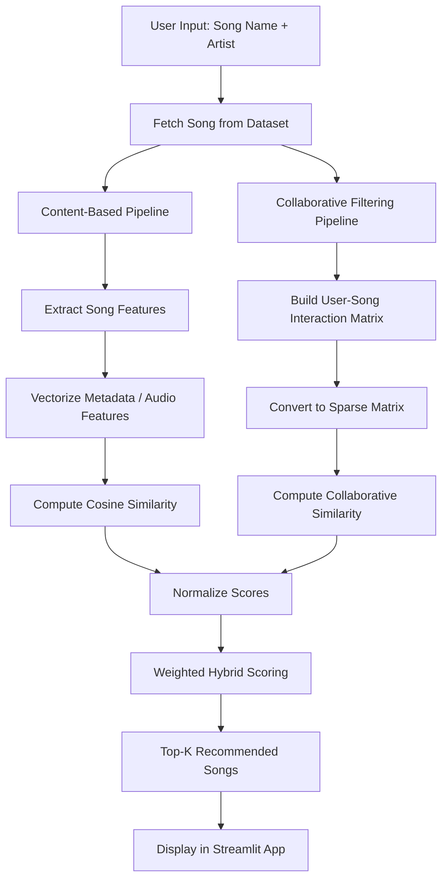

# 🎧 Spotify Hybrid Recommendation System

## 📌 Overview
This project implements a **Hybrid Music Recommendation System** inspired by platforms like Spotify. It combines **Content-Based Filtering** and **Collaborative Filtering** to generate personalized song recommendations. The system is designed to handle common recommender system challenges such as **cold start**, **data sparsity**, and **scalability**.

---

## 🚀 Features
- Recommend songs using **song name + artist name**
- Combine **content similarity** and **user interaction patterns**
- Handle **cold start** with content-based fallback
- Use **cosine similarity** for recommendation scoring
- Normalize scores before combining them
- Support a simple and interactive **Streamlit UI**

---

## 🧠 Recommendation Logic

### 1. Content-Based Filtering
This method recommends songs similar to the input song based on metadata and audio-related attributes. Songs are converted into vectors, and similarity is computed using cosine similarity.

### 2. Collaborative Filtering
This method uses a **user-song interaction matrix** built from listening history or play counts. It identifies relationships between songs based on collective user behavior.

### 3. Hybrid Recommendation
The final recommendation score is computed as:

`Hybrid Score = w1 * Content Score + w2 * Collaborative Score`

This allows the system to benefit from both:
- **Content-based personalization**
- **Collaborative behavioral learning**

---

## 🏗️ Architecture Diagram

## ⚙️ Workflow

1. User enters a **song name and artist name**  
2. System finds the **matching song in the dataset**  
3. **Content-based similarity** is computed  
4. **Collaborative filtering similarity** is computed  
5. Scores are **normalized**  
6. Final **hybrid score** is calculated  
7. Top recommendations are shown to the user  

---

## 🧩 Challenges Addressed

### ❄️ Cold Start Problem
If a song is new and has no interaction history, collaborative filtering cannot recommend it well.  
**Solution:** Use content-based recommendations as fallback.

### 📉 Data Sparsity
User-song interaction matrices are mostly empty in real-world systems.  
**Solution:** Use sparse matrix representation for efficient storage and computation.

### ⚖️ Score Imbalance
Collaborative and content-based scores may have different magnitudes.  
**Solution:** Normalize scores before combining them.

---

## 🛠️ Tech Stack
- Python  
- Pandas  
- NumPy  
- Scikit-learn  
- Streamlit  

---

## 📈 Business Impact
A hybrid recommender system can help:
- Increase user engagement  
- Improve click-through rate  
- Boost premium conversions  
- Reduce churn by improving personalization  

---

## 📌 Summary
This project demonstrates how a **Hybrid Recommender System** can combine the strengths of **Content-Based Filtering** and **Collaborative Filtering** to generate better music recommendations. It reflects real-world recommender system design used in modern streaming platforms.
